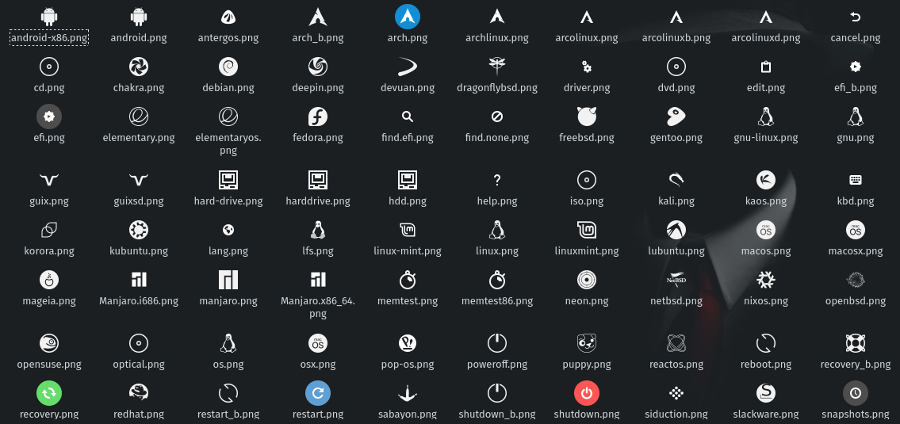
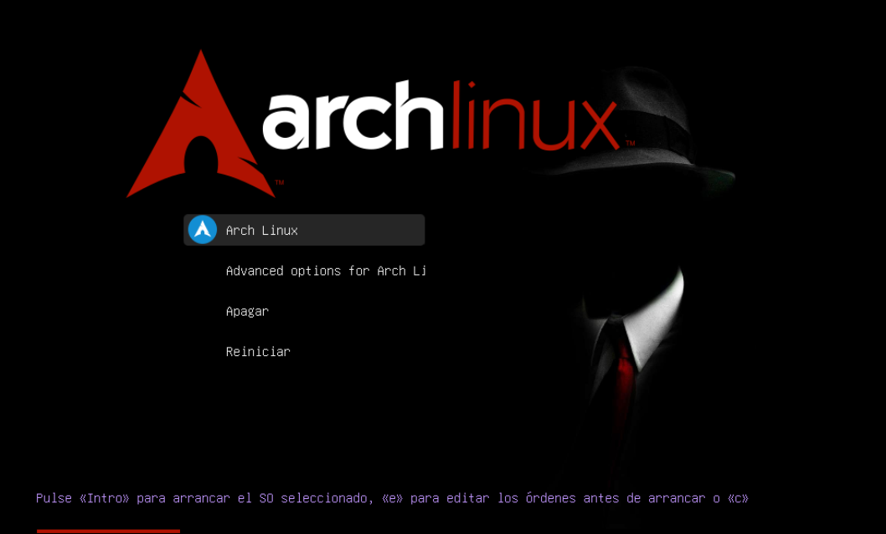

   [](https://github.com/foxfher/grub2Hat-ArchSES/graphs/contributors)    [](https://github.com/foxfher/grub2Hat-ArchSES/)
```
Instalación de Tema de Grub personalizado
```

###  &nbsp;  

```shell
$ git clone https://github.com/foxfher/grub2Hat-ArchSES.git 
$ ./install.sh -i 
# cp -r grub2Hat-ArchSES/* /boot/grub/themes/
```
###  &nbsp;  

```shell
$ install
usage: install (-i) 
example: install -i ejecuta grub-mkconfig para configurar el tema
	 install Solo copia los archivos del tema
```
###  &nbsp;  



####  &nbsp; 
 
```
Licencia MIT 
Copyright (c) 2019 Fernando Bello Mota <fbello04@hotmail.com> 
Se concede permiso por la presente, libre de cargos, a cualquier persona que obtenga una copia de este software y de los
archivos de documentación asociados (el Software), a utilizar el Software sin restricción, incluyendo sin limitación los
derechos a usar, copiar, modificar, fusionar, publicar, distribuir, sublicenciar, y/o vender copias del Software, y a 
permitir a las personas a las que se les proporcione el Software a hacer lo mismo, sujeto a las siguientes condiciones:
El aviso de copyright anterior y este aviso de permiso se incluirán en todas las copias o partes sustanciales del Software.

EL SOFTWARE SE PROPORCIONA COMO ESTÁ, SIN GARANTÍA DE NINGÚN TIPO, EXPRESA O IMPLÍCITA, INCLUYENDO PERO NO LIMITADO A
GARANTÍAS DE COMERCIALIZACIÓN, IDONEIDAD PARA UN PROPÓSITO PARTICULAR E INCUMPLIMIENTO. EN NINGÚN CASO LOS AUTORES O 
PROPIETARIOS DE LOS DERECHOS DE AUTOR SERÁN RESPONSABLES DE NINGUNA RECLAMACIÓN, DAÑOS U OTRAS RESPONSABILIDADES, YA SEA 
EN UNA ACCIÓN DE CONTRATO, AGRAVIO O CUALQUIER OTRO MOTIVO, DERIVADAS DE, FUERA DE O EN CONEXIÓN CON EL SOFTWARE O SU USO 
U OTRO TIPO DE ACCIONES EN EL SOFTWARE.
```
